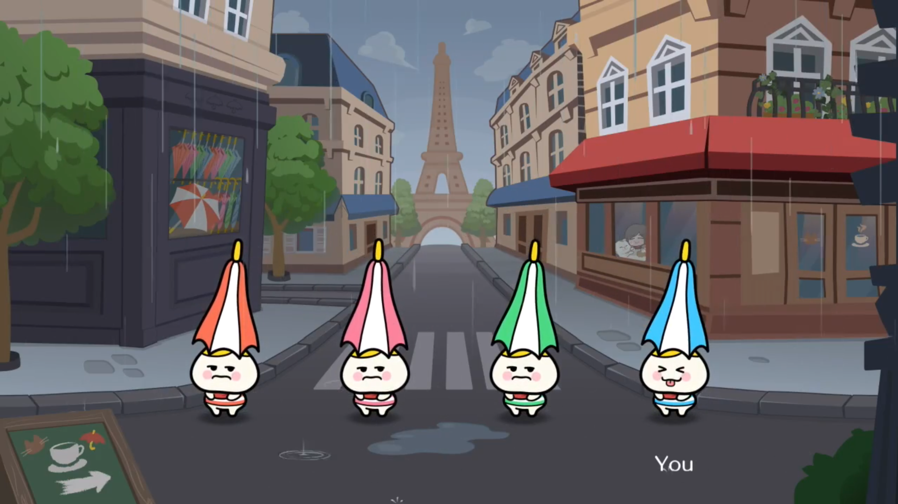

I’ve been a long time fan of rhythm games, yet somehow missed this franchise entirely until it came to the Switch. I heard a lot of hype around it, and having played it I now cannot stop talking about it. Every aspect of it has so much care put in, you can feel that the developers love this franchise and want you to love it too.

There are definitely some minigames that are weaker than others, but for some of the better ones, I found myself wanting to go back and play them even when there was nothing more I could earn. Already got perfect on the little umbrella guys? Don’t care, I wanna play again. The game threw lemons at me and I missed? That’s okay, I’ll play this game again, and enjoy it twice.

Trying to get the perfect three times in a row can be stressful, but my completionist streak knows better than to try and 100% this game. I’ll play the ones I enjoy, and be content with just passing the ones I don’t. But that’s only the single player, there’s a whole set of different games to play with friends, which had us laughing out loud repeatedly at how silly so many of them are.

This game is consistently funny, made by people who love their craft, and I cannot recommend it highly enough for anyone who is into rhythm games. It’s brought a level of joy to me that few games have reached, and I’m very grateful for that.

